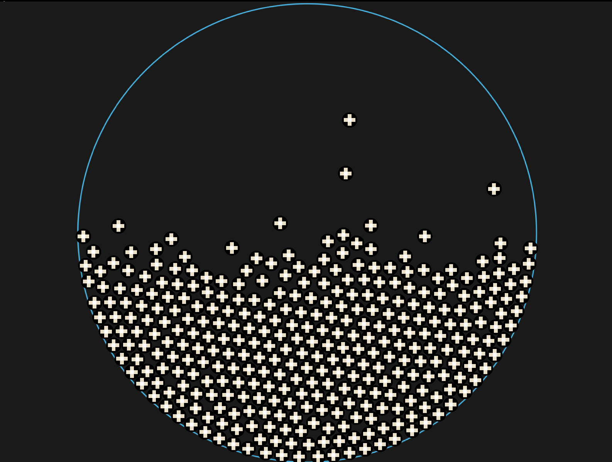

# Particle Simulator

Particle Simulator built with [SDL3](https://wiki.libsdl.org/SDL3/FrontPage) and OpenGL ES 3.2.

## Movement

Utilizes [verlet integration](https://www.algorithm-archive.org/contents/verlet_integration/verlet_integration.html) for realistic movement.

## Optimization

Grid Partitioning implemented for more efficient collision checking.
